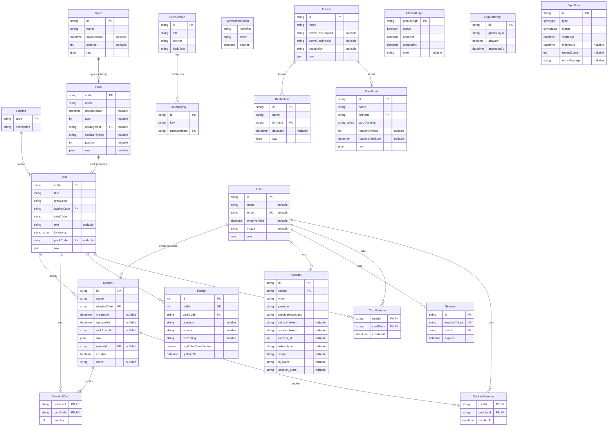

# jinteki — Database Schema Reference

_Generated by `scripts/generate-schema-doc.ts` on 2026-09-06T16:21:30.840Z from `prisma/schema.prisma` and `prisma/migrations/`. Do not hand-edit — re-run `pnpm docs:schema` instead._

**Source**: commit `4194e3b45fd7a9226ae99c354dbaeb0ff75dc9a2` (dirty — uncommitted changes present, doc may not match this commit) · 13 migrations: `20260727222007_init` .. `20260906161416_add_decklist_owner`

<details><summary>Full migration list</summary>

- `20260727222007_init`
- `20260728000126_add_sync_run_and_ruling_nrdb_id`
- `20260728141013_add_rules_sync_type`
- `20260728143000_add_rule_mapping_fk`
- `20260731065236_add_formats_restrictions`
- `20260731070336_restore_trgm_indexes`
- `20260803064956_declare_trgm_indexes`
- `20260803071858_add_format_description`
- `20260808194730_add_decklist_date_and_author_columns`
- `20260809064826_add_allowed_login_and_login_attempt`
- `20260904203544_add_card_pools`
- `20260905002012_add_cycles_and_pack_columns`
- `20260906161416_add_decklist_owner`

</details>

21 models, 3 enums, 17 foreign-key relationships.

## Entity-relationship diagram



## Enums

### `Role`

Users, roles, and Auth.js (next-auth@beta / v5) required tables

- `ADMIN`
- `USER`

```sql
-- from migrations/20260727222007_init/migration.sql
-- CreateEnum
CREATE TYPE "Role" AS ENUM ('ADMIN', 'USER');
```

### `SyncType`

Sync run log — Phase 2. Populated by src/sync/*.ts. Gives the admin sync page ("did the last sync work, when, how many records") something to show.

- `FACTIONS_PACKS`
- `CARDS`
- `DECKLISTS`
- `RULINGS`
- `RULES`
- `RESTRICTIONS`
- `CARD_POOLS`

```sql
-- from migrations/20260728000126_add_sync_run_and_ruling_nrdb_id/migration.sql
-- Phase 2: add SyncRun log table and Ruling.nrdbId natural key.
--
-- Generated via `prisma migrate diff` against the live dev database and
-- hand-trimmed: the raw `prisma migrate diff` output also proposed dropping
-- the five pg_trgm GIN indexes added by hand in the Phase 1 migration
-- (Card_title_trgm_idx, Card_text_trgm_idx, Decklist_name_trgm_idx,
-- RuleSection_title_trgm_idx, RuleSection_bodyText_trgm_idx). Those aren't
-- expressed in schema.prisma via Prisma's native index syntax, so the diff
-- tool doesn't know about them and treats them as drift to be removed. That
-- DropIndex block has been deliberately excluded from this file - those
-- indexes must stay.
--
-- Ruling table has zero rows at the time this migration is written (no sync
-- has run yet), so ADD COLUMN ... NOT NULL is safe without a default/backfill.

-- CreateEnum
CREATE TYPE "SyncType" AS ENUM ('FACTIONS_PACKS', 'CARDS', 'DECKLISTS', 'RULINGS');
```

### `SyncStatus`

- `RUNNING`
- `SUCCESS`
- `FAILED`

```sql
-- from migrations/20260728000126_add_sync_run_and_ruling_nrdb_id/migration.sql
-- CreateEnum
CREATE TYPE "SyncStatus" AS ENUM ('RUNNING', 'SUCCESS', 'FAILED');
```

## Models

### `Faction`

Card catalog (populated by a later-phase NRDB sync script; empty for now)

| Field | Type | Null? | Key | Notes |
|---|---|---|---|---|
| `code` | String | no | PK | — |
| `description` | String | no | — | — |

**Constraints**

- **Primary key**: (code)

<details><summary>Raw SQL (from prisma/migrations)</summary>

```sql
-- from migrations/20260727222007_init/migration.sql
-- CreateTable
CREATE TABLE "Faction" (
    "code" TEXT NOT NULL,
    "description" TEXT NOT NULL,

    CONSTRAINT "Faction_pkey" PRIMARY KEY ("code")
);
```

</details>

### `Cycle`

| Field | Type | Null? | Key | Notes |
|---|---|---|---|---|
| `id` | String | no | PK | — |
| `name` | String | no | — | — |
| `dateRelease` | DateTime? | yes | — | — |
| `position` | Int? | yes | — | — |
| `raw` | Json | no | — | — |

**Constraints**

- **Primary key**: (id)

<details><summary>Raw SQL (from prisma/migrations)</summary>

```sql
-- from migrations/20260905002012_add_cycles_and_pack_columns/migration.sql
-- CreateTable
CREATE TABLE "Cycle" (
    "id" TEXT NOT NULL,
    "name" TEXT NOT NULL,
    "dateRelease" TIMESTAMP(3),
    "position" INTEGER,
    "raw" JSONB NOT NULL,

    CONSTRAINT "Cycle_pkey" PRIMARY KEY ("id")
);
```

</details>

### `Pack`

| Field | Type | Null? | Key | Notes |
|---|---|---|---|---|
| `code` | String | no | PK | — |
| `name` | String | no | — | — |
| `dateRelease` | DateTime? | yes | — | — |
| `size` | Int? | yes | — | — |
| `cardCycleId` | String? | yes | FK | → Cycle.id |
| `cardSetTypeId` | String? | yes | — | — |
| `position` | Int? | yes | — | — |
| `raw` | Json? | yes | — | — |

**Constraints**

- **Primary key**: (code)

<details><summary>Raw SQL (from prisma/migrations)</summary>

```sql
-- from migrations/20260727222007_init/migration.sql
-- CreateTable
CREATE TABLE "Pack" (
    "code" TEXT NOT NULL,
    "name" TEXT NOT NULL,

    CONSTRAINT "Pack_pkey" PRIMARY KEY ("code")
);

-- from migrations/20260905002012_add_cycles_and_pack_columns/migration.sql
-- AlterTable
ALTER TABLE "Pack" ADD COLUMN     "cardCycleId" TEXT,
ADD COLUMN     "cardSetTypeId" TEXT,
ADD COLUMN     "dateRelease" TIMESTAMP(3),
ADD COLUMN     "position" INTEGER,
ADD COLUMN     "raw" JSONB,
ADD COLUMN     "size" INTEGER;

-- from migrations/20260905002012_add_cycles_and_pack_columns/migration.sql
-- AddForeignKey
ALTER TABLE "Pack" ADD CONSTRAINT "Pack_cardCycleId_fkey" FOREIGN KEY ("cardCycleId") REFERENCES "Cycle"("id") ON DELETE SET NULL ON UPDATE CASCADE;
```

</details>

### `Card`

| Field | Type | Null? | Key | Notes |
|---|---|---|---|---|
| `code` | String | no | PK | — |
| `title` | String | no | — | — |
| `typeCode` | String | no | — | — |
| `factionCode` | String | no | FK | → Faction.code |
| `sideCode` | String | no | — | — |
| `text` | String? | yes | — | — |
| `keywords` | String[] | no | — | — |
| `packCode` | String? | yes | FK | → Pack.code |
| `raw` | Json | no | — | — |

**Constraints**

- **Primary key**: (code)
- **Index**: (title(ops: raw("gin_trgm_ops")))
- **Index**: (text(ops: raw("gin_trgm_ops")))

<details><summary>Raw SQL (from prisma/migrations)</summary>

```sql
-- from migrations/20260727222007_init/migration.sql
-- CreateTable
CREATE TABLE "Card" (
    "code" TEXT NOT NULL,
    "title" TEXT NOT NULL,
    "typeCode" TEXT NOT NULL,
    "factionCode" TEXT NOT NULL,
    "sideCode" TEXT NOT NULL,
    "text" TEXT,
    "keywords" TEXT[],
    "packCode" TEXT,
    "raw" JSONB NOT NULL,

    CONSTRAINT "Card_pkey" PRIMARY KEY ("code")
);

-- from migrations/20260727222007_init/migration.sql
-- AddForeignKey
ALTER TABLE "Card" ADD CONSTRAINT "Card_factionCode_fkey" FOREIGN KEY ("factionCode") REFERENCES "Faction"("code") ON DELETE RESTRICT ON UPDATE CASCADE;

-- from migrations/20260727222007_init/migration.sql
-- AddForeignKey
ALTER TABLE "Card" ADD CONSTRAINT "Card_packCode_fkey" FOREIGN KEY ("packCode") REFERENCES "Pack"("code") ON DELETE SET NULL ON UPDATE CASCADE;

-- from migrations/20260727222007_init/migration.sql
CREATE INDEX "Card_title_trgm_idx" ON "Card" USING GIN ("title" gin_trgm_ops);

-- from migrations/20260727222007_init/migration.sql
CREATE INDEX "Card_text_trgm_idx" ON "Card" USING GIN ("text" gin_trgm_ops);

-- from migrations/20260731070336_restore_trgm_indexes/migration.sql
-- Restores the five pg_trgm GIN indexes that the previous migration
-- (20260731065236_add_formats_restrictions) accidentally dropped.
--
-- Root cause: these indexes were created by hand in the Phase 1 init
-- migration (CREATE INDEX ... USING GIN (col gin_trgm_ops)) because
-- Prisma's schema DSL has no way to express gin_trgm_ops. `prisma migrate
-- dev`'s auto-generated diff doesn't understand them, sees them as "extra"
-- relative to schema.prisma, and proposes dropping them on every migration
-- it generates. Three prior migrations
-- (20260728000126_add_sync_run_and_ruling_nrdb_id,
-- 20260728141013_add_rules_sync_type, 20260728143000_add_rule_mapping_fk)
-- each have a comment documenting that their auto-generated SQL had to be
-- hand-edited to strip out exactly these DROP INDEX statements before
-- applying. This migration's generation skipped that edit, so the DROP
-- INDEX statements went through and were applied to the live database.
--
-- Confirmed via `psql \di` that all five were actually gone (not just
-- present-in-file-but-unapplied) before writing this fix, and confirmed via
-- `\d` on the previous migration's file that it really did contain the drops
-- (this was not a pre-existing/environmental issue - it was introduced by
-- that migration).
--
-- See the warning comment now added directly in schema.prisma - every
-- future migration must be checked for these same spurious drops before
-- applying, since this will keep recurring as long as these indexes are
-- expressed as hand-written SQL rather than Prisma-native schema.

CREATE INDEX "Card_title_trgm_idx" ON "Card" USING GIN ("title" gin_trgm_ops);

-- from migrations/20260731070336_restore_trgm_indexes/migration.sql
CREATE INDEX "Card_text_trgm_idx" ON "Card" USING GIN ("text" gin_trgm_ops);
```

</details>

### `Decklist`

Decklists (populated by a later-phase NRDB sync script; empty for now)

| Field | Type | Null? | Key | Notes |
|---|---|---|---|---|
| `id` | String | no | PK | default: `cuid()` |
| `name` | String | no | — | — |
| `identityCode` | String | no | FK | → Card.code |
| `createdAt` | DateTime? | yes | — | — |
| `updatedAt` | DateTime? | yes | — | — |
| `nrdbUserId` | String? | yes | — | — |
| `raw` | Json | no | — | — |
| `ownerId` | String? | yes | FK | → User.id; ON DELETE Cascade |
| `isPublic` | Boolean | no | — | default: `true` |
| `notes` | String? | yes | — | — |

**Constraints**

- **Primary key**: (id)
- **Index**: (name(ops: raw("gin_trgm_ops")))
- **Index**: (createdAt)
- **Index**: (updatedAt)
- **Index**: (ownerId)

<details><summary>Raw SQL (from prisma/migrations)</summary>

```sql
-- from migrations/20260727222007_init/migration.sql
-- CreateTable
CREATE TABLE "Decklist" (
    "id" TEXT NOT NULL,
    "name" TEXT NOT NULL,
    "identityCode" TEXT NOT NULL,
    "raw" JSONB NOT NULL,

    CONSTRAINT "Decklist_pkey" PRIMARY KEY ("id")
);

-- from migrations/20260727222007_init/migration.sql
-- AddForeignKey
ALTER TABLE "Decklist" ADD CONSTRAINT "Decklist_identityCode_fkey" FOREIGN KEY ("identityCode") REFERENCES "Card"("code") ON DELETE RESTRICT ON UPDATE CASCADE;

-- from migrations/20260727222007_init/migration.sql
CREATE INDEX "Decklist_name_trgm_idx" ON "Decklist" USING GIN ("name" gin_trgm_ops);

-- from migrations/20260731070336_restore_trgm_indexes/migration.sql
CREATE INDEX "Decklist_name_trgm_idx" ON "Decklist" USING GIN ("name" gin_trgm_ops);

-- from migrations/20260808194730_add_decklist_date_and_author_columns/migration.sql
-- AlterTable
ALTER TABLE "Decklist" ADD COLUMN     "createdAt" TIMESTAMP(3),
ADD COLUMN     "nrdbUserId" TEXT,
ADD COLUMN     "updatedAt" TIMESTAMP(3);

-- from migrations/20260808194730_add_decklist_date_and_author_columns/migration.sql
-- CreateIndex
CREATE INDEX "Decklist_createdAt_idx" ON "Decklist"("createdAt");

-- from migrations/20260808194730_add_decklist_date_and_author_columns/migration.sql
-- CreateIndex
CREATE INDEX "Decklist_updatedAt_idx" ON "Decklist"("updatedAt");

-- from migrations/20260906161416_add_decklist_owner/migration.sql
-- AlterTable
ALTER TABLE "Decklist" ADD COLUMN     "isPublic" BOOLEAN NOT NULL DEFAULT true,
ADD COLUMN     "notes" TEXT,
ADD COLUMN     "ownerId" TEXT;

-- from migrations/20260906161416_add_decklist_owner/migration.sql
-- CreateIndex
CREATE INDEX "Decklist_ownerId_idx" ON "Decklist"("ownerId");

-- from migrations/20260906161416_add_decklist_owner/migration.sql
-- AddForeignKey
ALTER TABLE "Decklist" ADD CONSTRAINT "Decklist_ownerId_fkey" FOREIGN KEY ("ownerId") REFERENCES "User"("id") ON DELETE CASCADE ON UPDATE CASCADE;
```

</details>

### `DecklistCard`

| Field | Type | Null? | Key | Notes |
|---|---|---|---|---|
| `decklistId` | String | no | PK, FK | → Decklist.id; ON DELETE Cascade |
| `cardCode` | String | no | PK, FK | → Card.code |
| `quantity` | Int | no | — | — |

**Constraints**

- **Primary key**: (decklistId, cardCode)

<details><summary>Raw SQL (from prisma/migrations)</summary>

```sql
-- from migrations/20260727222007_init/migration.sql
-- CreateTable
CREATE TABLE "DecklistCard" (
    "decklistId" TEXT NOT NULL,
    "cardCode" TEXT NOT NULL,
    "quantity" INTEGER NOT NULL,

    CONSTRAINT "DecklistCard_pkey" PRIMARY KEY ("decklistId","cardCode")
);

-- from migrations/20260727222007_init/migration.sql
-- AddForeignKey
ALTER TABLE "DecklistCard" ADD CONSTRAINT "DecklistCard_decklistId_fkey" FOREIGN KEY ("decklistId") REFERENCES "Decklist"("id") ON DELETE CASCADE ON UPDATE CASCADE;

-- from migrations/20260727222007_init/migration.sql
-- AddForeignKey
ALTER TABLE "DecklistCard" ADD CONSTRAINT "DecklistCard_cardCode_fkey" FOREIGN KEY ("cardCode") REFERENCES "Card"("code") ON DELETE RESTRICT ON UPDATE CASCADE;
```

</details>

### `Ruling`

Official rulings (populated by a later-phase NRDB sync script; empty for now)

| Field | Type | Null? | Key | Notes |
|---|---|---|---|---|
| `id` | Int | no | PK | default: `autoincrement()` |
| `nrdbId` | Int | no | UK | — |
| `cardCode` | String | no | FK | → Card.code |
| `question` | String? | yes | — | — |
| `answer` | String? | yes | — | — |
| `textRuling` | String? | yes | — | — |
| `nsgRulesTeamVerified` | Boolean | no | — | default: `false` |
| `updatedAt` | DateTime | no | — | auto-set on update |

**Constraints**

- **Primary key**: (id)
- **Unique**: (nrdbId)

<details><summary>Raw SQL (from prisma/migrations)</summary>

```sql
-- from migrations/20260727222007_init/migration.sql
-- CreateTable
CREATE TABLE "Ruling" (
    "id" SERIAL NOT NULL,
    "cardCode" TEXT NOT NULL,
    "question" TEXT,
    "answer" TEXT,
    "textRuling" TEXT,
    "nsgRulesTeamVerified" BOOLEAN NOT NULL DEFAULT false,
    "updatedAt" TIMESTAMP(3) NOT NULL,

    CONSTRAINT "Ruling_pkey" PRIMARY KEY ("id")
);

-- from migrations/20260727222007_init/migration.sql
-- AddForeignKey
ALTER TABLE "Ruling" ADD CONSTRAINT "Ruling_cardCode_fkey" FOREIGN KEY ("cardCode") REFERENCES "Card"("code") ON DELETE RESTRICT ON UPDATE CASCADE;

-- from migrations/20260728000126_add_sync_run_and_ruling_nrdb_id/migration.sql
-- AlterTable
ALTER TABLE "Ruling" ADD COLUMN     "nrdbId" INTEGER NOT NULL;

-- from migrations/20260728000126_add_sync_run_and_ruling_nrdb_id/migration.sql
-- CreateIndex
CREATE UNIQUE INDEX "Ruling_nrdbId_key" ON "Ruling"("nrdbId");
```

</details>

### `RuleSection`

Comprehensive rules glossary RuleSection is populated by src/sync/sync-rules.ts (`pnpm sync:rules`, added in Phase 3) - a scraper for rules.nullsignal.games. RuleMapping is populated by prisma/seed.ts from prisma/rule-mapping-data.ts. Phase 1 deliberately left RuleMapping.ruleSectionId as a plain string column with NO db-level foreign key / Prisma relation to RuleSection, since RuleSection had zero rows at the time (a FK would have made the Phase 1 seed fail). Phase 3 activates the real FK now that RuleSection is populated for real (119 rows) and every RuleMapping row has been verified to reference a real RuleSection.id (see prisma/migrations and agent-reports/phase-3.md).

| Field | Type | Null? | Key | Notes |
|---|---|---|---|---|
| `id` | String | no | PK | — |
| `title` | String | no | — | — |
| `anchor` | String | no | — | — |
| `bodyText` | String | no | — | — |

**Constraints**

- **Primary key**: (id)
- **Index**: (title(ops: raw("gin_trgm_ops")))
- **Index**: (bodyText(ops: raw("gin_trgm_ops")))

<details><summary>Raw SQL (from prisma/migrations)</summary>

```sql
-- from migrations/20260727222007_init/migration.sql
-- CreateTable
CREATE TABLE "RuleSection" (
    "id" TEXT NOT NULL,
    "title" TEXT NOT NULL,
    "anchor" TEXT NOT NULL,
    "bodyText" TEXT NOT NULL,

    CONSTRAINT "RuleSection_pkey" PRIMARY KEY ("id")
);

-- from migrations/20260727222007_init/migration.sql
CREATE INDEX "RuleSection_title_trgm_idx" ON "RuleSection" USING GIN ("title" gin_trgm_ops);

-- from migrations/20260727222007_init/migration.sql
CREATE INDEX "RuleSection_bodyText_trgm_idx" ON "RuleSection" USING GIN ("bodyText" gin_trgm_ops);

-- from migrations/20260731070336_restore_trgm_indexes/migration.sql
CREATE INDEX "RuleSection_title_trgm_idx" ON "RuleSection" USING GIN ("title" gin_trgm_ops);

-- from migrations/20260731070336_restore_trgm_indexes/migration.sql
CREATE INDEX "RuleSection_bodyText_trgm_idx" ON "RuleSection" USING GIN ("bodyText" gin_trgm_ops);
```

</details>

### `RuleMapping`

| Field | Type | Null? | Key | Notes |
|---|---|---|---|---|
| `id` | String | no | PK | default: `cuid()` |
| `key` | String | no | — | — |
| `ruleSectionId` | String | no | FK | → RuleSection.id |

**Constraints**

- **Primary key**: (id)
- **Unique**: (key, ruleSectionId)
- **Index**: (key)

<details><summary>Raw SQL (from prisma/migrations)</summary>

```sql
-- from migrations/20260727222007_init/migration.sql
-- CreateTable
CREATE TABLE "RuleMapping" (
    "id" TEXT NOT NULL,
    "key" TEXT NOT NULL,
    "ruleSectionId" TEXT NOT NULL,

    CONSTRAINT "RuleMapping_pkey" PRIMARY KEY ("id")
);

-- from migrations/20260727222007_init/migration.sql
-- CreateIndex
CREATE INDEX "RuleMapping_key_idx" ON "RuleMapping"("key");

-- from migrations/20260727222007_init/migration.sql
-- CreateIndex
CREATE UNIQUE INDEX "RuleMapping_key_ruleSectionId_key" ON "RuleMapping"("key", "ruleSectionId");

-- from migrations/20260728143000_add_rule_mapping_fk/migration.sql
-- Activates the RuleMapping.ruleSectionId -> RuleSection.id foreign key,
-- deliberately deferred since Phase 1 (see schema.prisma's comment on
-- RuleSection/RuleMapping) until RuleSection actually had real rows.
--
-- Sequenced per PHASE_3_PLAN.md: `pnpm sync:rules` was run for real first
-- (119 RuleSection rows, confirmed via psql), then prisma/rule-mapping-data.ts
-- was replaced with the real curated mapping and reseeded (28 RuleMapping
-- rows, confirmed via psql that every ruleSectionId referenced resolves to a
-- real RuleSection.id - see verify-mapping.mjs's output in
-- agent-reports/phase-3.md), and only then is this FK added.
--
-- Hand-written from `prisma migrate diff`'s output with the AddForeignKey
-- line kept and the DropIndex statements deliberately excluded -
-- `migrate diff` doesn't understand the hand-written pg_trgm GIN indexes
-- (not expressed via Prisma's schema syntax) and proposes dropping all five
-- of them every time it's run - same issue hit in Phase 2's and this
-- phase's earlier RULES-enum migration. Those indexes must survive.

ALTER TABLE "RuleMapping" ADD CONSTRAINT "RuleMapping_ruleSectionId_fkey" FOREIGN KEY ("ruleSectionId") REFERENCES "RuleSection"("id") ON DELETE RESTRICT ON UPDATE CASCADE;
```

</details>

### `User`

| Field | Type | Null? | Key | Notes |
|---|---|---|---|---|
| `id` | String | no | PK | default: `cuid()` |
| `name` | String? | yes | — | — |
| `email` | String? | yes | UK | — |
| `emailVerified` | DateTime? | yes | — | — |
| `image` | String? | yes | — | — |
| `role` | Role | no | — | default: `USER` |

**Constraints**

- **Primary key**: (id)
- **Unique**: (email)

<details><summary>Raw SQL (from prisma/migrations)</summary>

```sql
-- from migrations/20260727222007_init/migration.sql
-- CreateTable
CREATE TABLE "User" (
    "id" TEXT NOT NULL,
    "name" TEXT,
    "email" TEXT,
    "emailVerified" TIMESTAMP(3),
    "image" TEXT,
    "role" "Role" NOT NULL DEFAULT 'USER',

    CONSTRAINT "User_pkey" PRIMARY KEY ("id")
);

-- from migrations/20260727222007_init/migration.sql
-- CreateIndex
CREATE UNIQUE INDEX "User_email_key" ON "User"("email");
```

</details>

### `Account`

Standard Auth.js Prisma-adapter shape, unmodified.

| Field | Type | Null? | Key | Notes |
|---|---|---|---|---|
| `id` | String | no | PK | default: `cuid()` |
| `userId` | String | no | FK | → User.id; ON DELETE Cascade |
| `type` | String | no | — | — |
| `provider` | String | no | — | — |
| `providerAccountId` | String | no | — | — |
| `refresh_token` | String? | yes | — | TEXT (unbounded) |
| `access_token` | String? | yes | — | TEXT (unbounded) |
| `expires_at` | Int? | yes | — | — |
| `token_type` | String? | yes | — | — |
| `scope` | String? | yes | — | — |
| `id_token` | String? | yes | — | TEXT (unbounded) |
| `session_state` | String? | yes | — | — |

**Constraints**

- **Primary key**: (id)
- **Unique**: (provider, providerAccountId)

<details><summary>Raw SQL (from prisma/migrations)</summary>

```sql
-- from migrations/20260727222007_init/migration.sql
-- CreateTable
CREATE TABLE "Account" (
    "id" TEXT NOT NULL,
    "userId" TEXT NOT NULL,
    "type" TEXT NOT NULL,
    "provider" TEXT NOT NULL,
    "providerAccountId" TEXT NOT NULL,
    "refresh_token" TEXT,
    "access_token" TEXT,
    "expires_at" INTEGER,
    "token_type" TEXT,
    "scope" TEXT,
    "id_token" TEXT,
    "session_state" TEXT,

    CONSTRAINT "Account_pkey" PRIMARY KEY ("id")
);

-- from migrations/20260727222007_init/migration.sql
-- CreateIndex
CREATE UNIQUE INDEX "Account_provider_providerAccountId_key" ON "Account"("provider", "providerAccountId");

-- from migrations/20260727222007_init/migration.sql
-- AddForeignKey
ALTER TABLE "Account" ADD CONSTRAINT "Account_userId_fkey" FOREIGN KEY ("userId") REFERENCES "User"("id") ON DELETE CASCADE ON UPDATE CASCADE;
```

</details>

### `Session`

| Field | Type | Null? | Key | Notes |
|---|---|---|---|---|
| `id` | String | no | PK | default: `cuid()` |
| `sessionToken` | String | no | UK | — |
| `userId` | String | no | FK | → User.id; ON DELETE Cascade |
| `expires` | DateTime | no | — | — |

**Constraints**

- **Primary key**: (id)
- **Unique**: (sessionToken)

<details><summary>Raw SQL (from prisma/migrations)</summary>

```sql
-- from migrations/20260727222007_init/migration.sql
-- CreateTable
CREATE TABLE "Session" (
    "id" TEXT NOT NULL,
    "sessionToken" TEXT NOT NULL,
    "userId" TEXT NOT NULL,
    "expires" TIMESTAMP(3) NOT NULL,

    CONSTRAINT "Session_pkey" PRIMARY KEY ("id")
);

-- from migrations/20260727222007_init/migration.sql
-- CreateIndex
CREATE UNIQUE INDEX "Session_sessionToken_key" ON "Session"("sessionToken");

-- from migrations/20260727222007_init/migration.sql
-- AddForeignKey
ALTER TABLE "Session" ADD CONSTRAINT "Session_userId_fkey" FOREIGN KEY ("userId") REFERENCES "User"("id") ON DELETE CASCADE ON UPDATE CASCADE;
```

</details>

### `VerificationToken`

| Field | Type | Null? | Key | Notes |
|---|---|---|---|---|
| `identifier` | String | no | — | — |
| `token` | String | no | — | — |
| `expires` | DateTime | no | — | — |

**Constraints**

- **Unique**: (identifier, token)

<details><summary>Raw SQL (from prisma/migrations)</summary>

```sql
-- from migrations/20260727222007_init/migration.sql
-- CreateTable
CREATE TABLE "VerificationToken" (
    "identifier" TEXT NOT NULL,
    "token" TEXT NOT NULL,
    "expires" TIMESTAMP(3) NOT NULL
);

-- from migrations/20260727222007_init/migration.sql
-- CreateIndex
CREATE UNIQUE INDEX "VerificationToken_identifier_token_key" ON "VerificationToken"("identifier", "token");
```

</details>

### `CardFavorite`

Favorites — two plain join tables rather than one polymorphic table

| Field | Type | Null? | Key | Notes |
|---|---|---|---|---|
| `userId` | String | no | PK, FK | → User.id; ON DELETE Cascade |
| `cardCode` | String | no | PK, FK | → Card.code; ON DELETE Cascade |
| `createdAt` | DateTime | no | — | default: `now()` |

**Constraints**

- **Primary key**: (userId, cardCode)

<details><summary>Raw SQL (from prisma/migrations)</summary>

```sql
-- from migrations/20260727222007_init/migration.sql
-- CreateTable
CREATE TABLE "CardFavorite" (
    "userId" TEXT NOT NULL,
    "cardCode" TEXT NOT NULL,
    "createdAt" TIMESTAMP(3) NOT NULL DEFAULT CURRENT_TIMESTAMP,

    CONSTRAINT "CardFavorite_pkey" PRIMARY KEY ("userId","cardCode")
);

-- from migrations/20260727222007_init/migration.sql
-- AddForeignKey
ALTER TABLE "CardFavorite" ADD CONSTRAINT "CardFavorite_userId_fkey" FOREIGN KEY ("userId") REFERENCES "User"("id") ON DELETE CASCADE ON UPDATE CASCADE;

-- from migrations/20260727222007_init/migration.sql
-- AddForeignKey
ALTER TABLE "CardFavorite" ADD CONSTRAINT "CardFavorite_cardCode_fkey" FOREIGN KEY ("cardCode") REFERENCES "Card"("code") ON DELETE CASCADE ON UPDATE CASCADE;
```

</details>

### `DecklistFavorite`

| Field | Type | Null? | Key | Notes |
|---|---|---|---|---|
| `userId` | String | no | PK, FK | → User.id; ON DELETE Cascade |
| `decklistId` | String | no | PK, FK | → Decklist.id; ON DELETE Cascade |
| `createdAt` | DateTime | no | — | default: `now()` |

**Constraints**

- **Primary key**: (userId, decklistId)

<details><summary>Raw SQL (from prisma/migrations)</summary>

```sql
-- from migrations/20260727222007_init/migration.sql
-- CreateTable
CREATE TABLE "DecklistFavorite" (
    "userId" TEXT NOT NULL,
    "decklistId" TEXT NOT NULL,
    "createdAt" TIMESTAMP(3) NOT NULL DEFAULT CURRENT_TIMESTAMP,

    CONSTRAINT "DecklistFavorite_pkey" PRIMARY KEY ("userId","decklistId")
);

-- from migrations/20260727222007_init/migration.sql
-- AddForeignKey
ALTER TABLE "DecklistFavorite" ADD CONSTRAINT "DecklistFavorite_userId_fkey" FOREIGN KEY ("userId") REFERENCES "User"("id") ON DELETE CASCADE ON UPDATE CASCADE;

-- from migrations/20260727222007_init/migration.sql
-- AddForeignKey
ALTER TABLE "DecklistFavorite" ADD CONSTRAINT "DecklistFavorite_decklistId_fkey" FOREIGN KEY ("decklistId") REFERENCES "Decklist"("id") ON DELETE CASCADE ON UPDATE CASCADE;
```

</details>

### `Format`

Formats & restrictions (Most Wanted List / format-legality data) — Phase 6. Populated by src/sync/sync-restrictions.ts. Real API shape (verified live against api.netrunnerdb.com/api/v3/public, not the plan's original guessed draft - see agent-reports/phase-6.md): a `Format` (Standard/Startup/Eternal/...) points at whichever `Restriction` (a single named MWL/ban-list snapshot, e.g. "Standard Ban List 26.03") is currently active for it via `activeRestrictionId`. A Restriction's actual banned/restricted/points verdicts are keyed by card code inside `raw` (`attributes.verdicts`) - not flattened into a separate per-card join table, since NRDB's own `cards` resource *also* already carries a per-card `restrictions` history blob (keyed by restriction id) in `Card.raw`, so a second normalized copy of the same banned/restricted/points membership isn't needed to answer "is this card currently banned/restricted in this format" - only the format -> active-restriction-id link was missing, which is what this table actually adds. `activeRestrictionId` is deliberately a plain string, not a Prisma `@relation` - avoids a Format<->Restriction insert-ordering dependency (Format rows are upserted before the Restriction rows they point at exist yet on a first-ever sync), same reasoning Phase 1 used for `RuleMapping.ruleSectionId` before RuleSection had real rows.

| Field | Type | Null? | Key | Notes |
|---|---|---|---|---|
| `id` | String | no | PK | — |
| `name` | String | no | — | — |
| `activeRestrictionId` | String? | yes | — | — |
| `activeCardPoolId` | String? | yes | — | — |
| `description` | String? | yes | — | — |
| `raw` | Json | no | — | — |

**Constraints**

- **Primary key**: (id)

<details><summary>Raw SQL (from prisma/migrations)</summary>

```sql
-- from migrations/20260731065236_add_formats_restrictions/migration.sql
-- CreateTable
CREATE TABLE "Format" (
    "id" TEXT NOT NULL,
    "name" TEXT NOT NULL,
    "activeRestrictionId" TEXT,
    "raw" JSONB NOT NULL,

    CONSTRAINT "Format_pkey" PRIMARY KEY ("id")
);

-- from migrations/20260803071858_add_format_description/migration.sql
-- AlterTable
ALTER TABLE "Format" ADD COLUMN     "description" TEXT;

-- from migrations/20260904203544_add_card_pools/migration.sql
-- AlterTable
ALTER TABLE "Format" ADD COLUMN     "activeCardPoolId" TEXT;
```

</details>

### `Restriction`

| Field | Type | Null? | Key | Notes |
|---|---|---|---|---|
| `id` | String | no | PK | — |
| `name` | String | no | — | — |
| `formatId` | String | no | FK | → Format.id |
| `dateStart` | DateTime? | yes | — | — |
| `raw` | Json | no | — | — |

**Constraints**

- **Primary key**: (id)

<details><summary>Raw SQL (from prisma/migrations)</summary>

```sql
-- from migrations/20260731065236_add_formats_restrictions/migration.sql
-- CreateTable
CREATE TABLE "Restriction" (
    "id" TEXT NOT NULL,
    "name" TEXT NOT NULL,
    "formatId" TEXT NOT NULL,
    "dateStart" TIMESTAMP(3),
    "raw" JSONB NOT NULL,

    CONSTRAINT "Restriction_pkey" PRIMARY KEY ("id")
);

-- from migrations/20260731065236_add_formats_restrictions/migration.sql
-- AddForeignKey
ALTER TABLE "Restriction" ADD CONSTRAINT "Restriction_formatId_fkey" FOREIGN KEY ("formatId") REFERENCES "Format"("id") ON DELETE RESTRICT ON UPDATE CASCADE;
```

</details>

### `CardPool`

Card pools ("rotation" data) — Phase 10 §2. Populated by src/sync/sync-card-pools.ts from NRDB's `card_pools` resource - a DIFFERENT resource from `card_sets` (Pack) and from `card_cycles` (Cycle). A `CardPool` is one named, dated-or-undated snapshot of "every card cycle legal in format X as of this pool" (e.g. Standard's "Seventh Rotation", "Pre Rotation", or the currently-active "Standard 2026 - Vantage Point"). Confirmed live 2026-09-04 (api.netrunnerdb.com/api/v3/public/card_pools): unlike Restriction, a card_pools resource carries NO date_start and NO per-snapshot "active" flag of its own - just { name, format_id, card_cycle_ids, updated_at, num_cards }. So Restriction's active/ scheduled/past classification (Phase 10 §1) does NOT transfer to CardPool - there's nothing to classify against. This was confirmed at build time per the plan's explicit instruction to check, not assumed. `rotationOrdinal`/`rotationDateStart` are populated only for the subset of card pools that are genuinely one of NSG's numbered "Nth Rotation" events (Standard-only) - sourced from netrunner-cards-json's root-level `rotations.json` file (a repo file, not an API resource, fetched separately by the sync step), matched by transforming that file's `code` ("rotation-2017") into the matching card_pools id ("rotation_2017"). Deliberately NOT derived by string-matching `card_pools.attributes.name` against `.*Rotation$` - `rotation_2020` ("Salvaged Memories") is a real, non-rotation-numbered pool that would break a naive sequential match (confirmed live - see rotationOrdinal's non-sequential test case in sync-card-pools.test.ts). Both columns are null for every pool that isn't one of the seven numbered rotations (pre_rotation, the currently-active pool, salvaged_memories, and every non-Standard format's pools all have null here) - that's expected, not a sync gap.

| Field | Type | Null? | Key | Notes |
|---|---|---|---|---|
| `id` | String | no | PK | — |
| `name` | String | no | — | — |
| `formatId` | String | no | FK | → Format.id |
| `cardCycleIds` | String[] | no | — | — |
| `rotationOrdinal` | Int? | yes | — | — |
| `rotationDateStart` | DateTime? | yes | — | — |
| `raw` | Json | no | — | — |

**Constraints**

- **Primary key**: (id)

<details><summary>Raw SQL (from prisma/migrations)</summary>

```sql
-- from migrations/20260904203544_add_card_pools/migration.sql
-- CreateTable
CREATE TABLE "CardPool" (
    "id" TEXT NOT NULL,
    "name" TEXT NOT NULL,
    "formatId" TEXT NOT NULL,
    "cardCycleIds" TEXT[],
    "rotationOrdinal" INTEGER,
    "rotationDateStart" TIMESTAMP(3),
    "raw" JSONB NOT NULL,

    CONSTRAINT "CardPool_pkey" PRIMARY KEY ("id")
);

-- from migrations/20260904203544_add_card_pools/migration.sql
-- AddForeignKey
ALTER TABLE "CardPool" ADD CONSTRAINT "CardPool_formatId_fkey" FOREIGN KEY ("formatId") REFERENCES "Format"("id") ON DELETE RESTRICT ON UPDATE CASCADE;
```

</details>

### `AllowedLogin`

Remote access allowlist + sign-in audit log — Phase 9 (PHASE_9_PLAN.md §1, plans/design/REMOTE_ACCESS_DESIGN.md Decision 5). AllowedLogin is keyed by GitHub `login` (username), not User.id/email - it must be populatable *before* the person it refers to has ever signed in, so it can't reference anything that only exists after their first login. `active` (not row presence/absence) is the actual gate, so deactivating someone keeps their addedAt/note history instead of losing it. LoginAttempt is deliberately NOT a Prisma relation to AllowedLogin - a relation would force every attempt to reference an existing AllowedLogin row, but the whole point of logging attempts is to also capture logins from GitHub accounts that were never allowlisted at all (a stranger trying the URL). `githubLogin` is the key column throughout (not `userId`) since a rejected attempt never gets a User row to point at.

| Field | Type | Null? | Key | Notes |
|---|---|---|---|---|
| `githubLogin` | String | no | PK | — |
| `active` | Boolean | no | — | default: `true` |
| `addedAt` | DateTime | no | — | default: `now()` |
| `updatedAt` | DateTime | no | — | auto-set on update |
| `note` | String? | yes | — | — |

**Constraints**

- **Primary key**: (githubLogin)

<details><summary>Raw SQL (from prisma/migrations)</summary>

```sql
-- from migrations/20260809064826_add_allowed_login_and_login_attempt/migration.sql
-- CreateTable
CREATE TABLE "AllowedLogin" (
    "githubLogin" TEXT NOT NULL,
    "active" BOOLEAN NOT NULL DEFAULT true,
    "addedAt" TIMESTAMP(3) NOT NULL DEFAULT CURRENT_TIMESTAMP,
    "updatedAt" TIMESTAMP(3) NOT NULL,
    "note" TEXT,

    CONSTRAINT "AllowedLogin_pkey" PRIMARY KEY ("githubLogin")
);
```

</details>

### `LoginAttempt`

| Field | Type | Null? | Key | Notes |
|---|---|---|---|---|
| `id` | String | no | PK | default: `cuid()` |
| `githubLogin` | String | no | — | — |
| `allowed` | Boolean | no | — | — |
| `attemptedAt` | DateTime | no | — | default: `now()` |

**Constraints**

- **Primary key**: (id)
- **Index**: (githubLogin)
- **Index**: (attemptedAt)

<details><summary>Raw SQL (from prisma/migrations)</summary>

```sql
-- from migrations/20260809064826_add_allowed_login_and_login_attempt/migration.sql
-- CreateTable
CREATE TABLE "LoginAttempt" (
    "id" TEXT NOT NULL,
    "githubLogin" TEXT NOT NULL,
    "allowed" BOOLEAN NOT NULL,
    "attemptedAt" TIMESTAMP(3) NOT NULL DEFAULT CURRENT_TIMESTAMP,

    CONSTRAINT "LoginAttempt_pkey" PRIMARY KEY ("id")
);

-- from migrations/20260809064826_add_allowed_login_and_login_attempt/migration.sql
-- CreateIndex
CREATE INDEX "LoginAttempt_githubLogin_idx" ON "LoginAttempt"("githubLogin");

-- from migrations/20260809064826_add_allowed_login_and_login_attempt/migration.sql
-- CreateIndex
CREATE INDEX "LoginAttempt_attemptedAt_idx" ON "LoginAttempt"("attemptedAt");
```

</details>

### `SyncRun`

| Field | Type | Null? | Key | Notes |
|---|---|---|---|---|
| `id` | String | no | PK | default: `cuid()` |
| `type` | SyncType | no | — | — |
| `status` | SyncStatus | no | — | — |
| `startedAt` | DateTime | no | — | default: `now()` |
| `finishedAt` | DateTime? | yes | — | — |
| `recordCount` | Int? | yes | — | — |
| `errorMessage` | String? | yes | — | — |

**Constraints**

- **Primary key**: (id)
- **Index**: (type, status, startedAt)

<details><summary>Raw SQL (from prisma/migrations)</summary>

```sql
-- from migrations/20260728000126_add_sync_run_and_ruling_nrdb_id/migration.sql
-- CreateTable
CREATE TABLE "SyncRun" (
    "id" TEXT NOT NULL,
    "type" "SyncType" NOT NULL,
    "status" "SyncStatus" NOT NULL,
    "startedAt" TIMESTAMP(3) NOT NULL DEFAULT CURRENT_TIMESTAMP,
    "finishedAt" TIMESTAMP(3),
    "recordCount" INTEGER,
    "errorMessage" TEXT,

    CONSTRAINT "SyncRun_pkey" PRIMARY KEY ("id")
);

-- from migrations/20260728000126_add_sync_run_and_ruling_nrdb_id/migration.sql
-- CreateIndex
CREATE INDEX "SyncRun_type_status_startedAt_idx" ON "SyncRun"("type", "status", "startedAt");
```

</details>

## Relationships

| From | FK column(s) | To | References | On delete | Optional? |
|---|---|---|---|---|---|
| `Pack`.`cycle` | `cardCycleId` | `Cycle` | `id` | (default: Restrict) | yes |
| `Card`.`faction` | `factionCode` | `Faction` | `code` | (default: Restrict) | no |
| `Card`.`pack` | `packCode` | `Pack` | `code` | (default: Restrict) | yes |
| `Decklist`.`identity` | `identityCode` | `Card` | `code` | (default: Restrict) | no |
| `Decklist`.`owner` | `ownerId` | `User` | `id` | Cascade | yes |
| `DecklistCard`.`decklist` | `decklistId` | `Decklist` | `id` | Cascade | no |
| `DecklistCard`.`card` | `cardCode` | `Card` | `code` | (default: Restrict) | no |
| `Ruling`.`card` | `cardCode` | `Card` | `code` | (default: Restrict) | no |
| `RuleMapping`.`ruleSection` | `ruleSectionId` | `RuleSection` | `id` | (default: Restrict) | no |
| `Account`.`user` | `userId` | `User` | `id` | Cascade | no |
| `Session`.`user` | `userId` | `User` | `id` | Cascade | no |
| `CardFavorite`.`user` | `userId` | `User` | `id` | Cascade | no |
| `CardFavorite`.`card` | `cardCode` | `Card` | `code` | Cascade | no |
| `DecklistFavorite`.`user` | `userId` | `User` | `id` | Cascade | no |
| `DecklistFavorite`.`decklist` | `decklistId` | `Decklist` | `id` | Cascade | no |
| `Restriction`.`format` | `formatId` | `Format` | `id` | (default: Restrict) | no |
| `CardPool`.`format` | `formatId` | `Format` | `id` | (default: Restrict) | no |

## Unclassified SQL statements

_Statements the parser couldn't attribute to a specific table (review manually):_

```sql
-- from migrations/20260727222007_init/migration.sql
-- Trigram search support (pg_trgm + GIN indexes)
-- Prisma's schema DSL can't express trigram indexes natively, so these are
-- added here as raw SQL, per PHASE_1_PLAN.md.
CREATE EXTENSION IF NOT EXISTS pg_trgm;

-- from migrations/20260728141013_add_rules_sync_type/migration.sql
-- Add the RULES value to the SyncType enum (Phase 3: rules-doc scraper /
-- pnpm sync:rules). Hand-written from `prisma migrate diff`'s output with
-- the AlterEnum line kept and the DropIndex statements deliberately
-- excluded - `migrate diff` doesn't understand the hand-written pg_trgm GIN
-- indexes (they aren't expressed via Prisma's schema syntax) and proposes
-- dropping all five of them every time it's run, same issue Phase 2 hit.
-- Those indexes must survive; see agent-reports/phase-2.md for the same note.

ALTER TYPE "SyncType" ADD VALUE 'RULES';

-- from migrations/20260731065236_add_formats_restrictions/migration.sql
-- AlterEnum
ALTER TYPE "SyncType" ADD VALUE 'RESTRICTIONS';

-- from migrations/20260731065236_add_formats_restrictions/migration.sql
-- DropIndex
DROP INDEX "Card_text_trgm_idx";

-- from migrations/20260731065236_add_formats_restrictions/migration.sql
-- DropIndex
DROP INDEX "Card_title_trgm_idx";

-- from migrations/20260731065236_add_formats_restrictions/migration.sql
-- DropIndex
DROP INDEX "Decklist_name_trgm_idx";

-- from migrations/20260731065236_add_formats_restrictions/migration.sql
-- DropIndex
DROP INDEX "RuleSection_bodyText_trgm_idx";

-- from migrations/20260731065236_add_formats_restrictions/migration.sql
-- DropIndex
DROP INDEX "RuleSection_title_trgm_idx";

-- from migrations/20260803064956_declare_trgm_indexes/migration.sql
-- This is an empty migration.;

-- from migrations/20260904203544_add_card_pools/migration.sql
-- AlterEnum
ALTER TYPE "SyncType" ADD VALUE 'CARD_POOLS';
```
